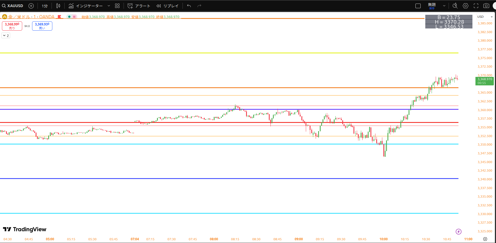
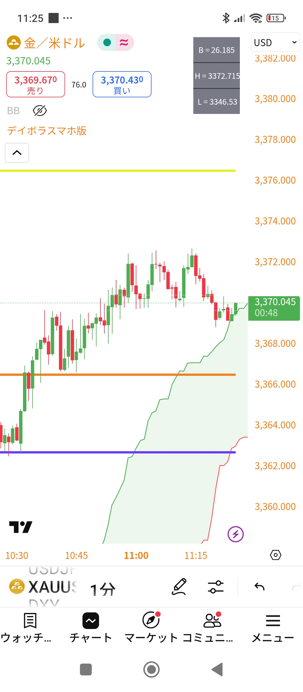

# 金のボラティリティ表示インジケーター for TradingView

このプロジェクトは、TradingViewで使用できるカスタムインジケーターです。主に金（XAUUSD）の日中の価格変動（ボラティリティ）を分析し、重要なサポートラインやレジスタンスラインの目安をチャート上に表示します。PC版とモバイル版の2つのスクリプトが含まれています。

## 主な機能

*   **デイリーデータの表示**:
    *   当日の高値、安値、始値をチャート上に表示します。
    *   当日のボラティリティ（高値と安値の差）を数値で表示します。
    *   これらの情報は、チャート右上にコンパクトなテーブル形式で表示されます。
*   **重要価格ラインの描画**:
    *   当日高値ライン、当日安値ライン、当日始値ライン。
    *   当日安値に一定の値幅（例: +10, +20, +30, +40, +50, +60ドル）を加えた価格帯にサポートライン候補を描画。
    *   当日高値から一定の値幅（例: -10, -20, -30, -40, -50, -60ドル）を引いた価格帯にレジスタンスライン候補を描画。
    *   PC版 (`gold-vola-gui.pine`) では、さらに短期的な目安として±6ドル、±9ドルのラインも表示されます。
*   **アラート機能**:
    *   価格が特定の計算済みライン（例: DayLow+10, DayHigh-10など）をクロスした際にTradingViewのアラートで通知を受け取ることができます。
*   **一目均衡表の雲**:
    *   相場のサポート、レジスタンス、トレンドの方向性を示唆する一目均衡表の「雲」を表示します。

## ファイル構成

*   `gold-vola-gui.pine`: PCのブラウザ表示に最適化されたインジケーターコードです。
*   `gold-vola-gui-mobile.pine`: スマートフォンのTradingViewアプリ表示に最適化されたインジケーターコードです。
*   `picture/pcチャート画像.png`: PC版インジケーターの表示例です。
    *   
*   `picture/mobile画像.jpg`: モバイル版インジケーターの表示例です。
    *   

## 使用方法

1.  TradingViewを開きます。
2.  チャート画面下部にある「Pineエディタ」タブを開きます。
3.  エディタ内の既存のコードを削除し、使用したいバージョン（PC版またはモバイル版）の `.pine` ファイルの中身を全てコピー＆ペーストします。
4.  「チャートに追加」ボタンをクリックします。
5.  必要に応じて、インジケーターの設定からアラート条件を作成してください。

## ライセンス

このプロジェクトは [Mozilla Public License 2.0](LICENSE) の下で公開されています。 
